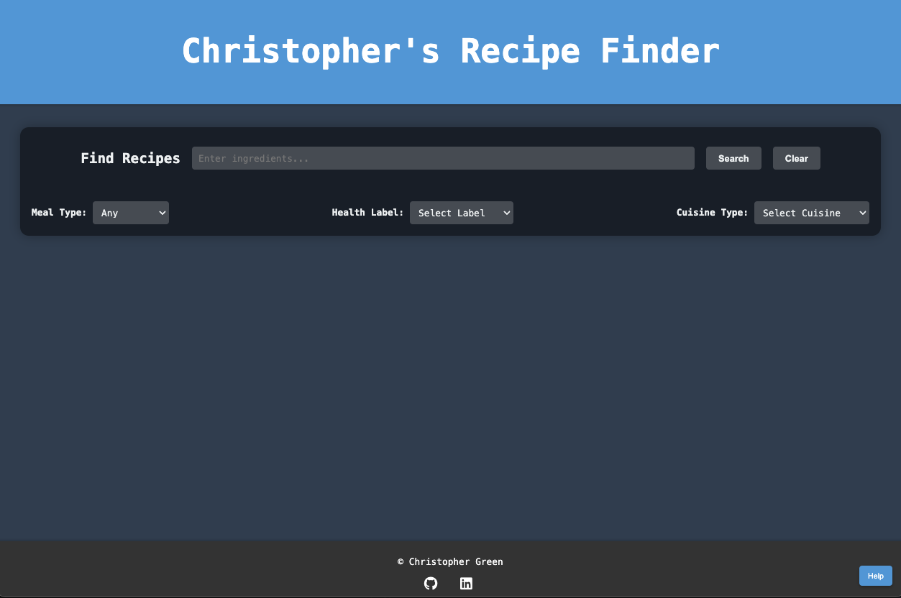

# Christopher's Recipe Finder



Explore a wide variety of delicious recipes with Christopher's Recipe Finder. Try it out here: [Christopher's Recipe Finder Live Site](https://cgreen66.github.io/RecipeFinder/)

## Overview
"Christopher's Recipe Finder" is a sophisticated web application designed for culinary enthusiasts. It streamlines the recipe discovery process by integrating user-friendly interfaces with real-time data fetching.

### Key Features
- **Ingredient-Based Recipe Search**: Users can search for recipes based on specific ingredients.
- **Advanced Filtering Options**: Recipes can be filtered by meal type and health labels.
- **Interactive Recipe Cards**: Concise summary of each recipe, including images and source details.
- **Comprehensive Nutritional Information**: Detailed breakdown of macronutrients available in a modal.
- **Responsive Design**: Ensures a seamless user experience across various devices.

## Technologies
- **Frontend**: HTML5, SCSS, Vanilla JavaScript (compiled to CSS3 for production).
- **Animations**: GreenSock Animation Platform (GSAP) for UI animations.
- **API Integration**: Real-time recipe data fetched from Edamam API.

## User Interface Highlights
- **Interactive Search Bar**: Autocomplete functionality for enhanced user experience.
- **Recipe Cards**: Attractive visuals with direct links to cooking instructions.
- **Nutritional Information Modals**: User-friendly presentation of comprehensive nutritional data.

## Code Examples

### Dynamic Recipe Search Functionality
```javascript
// Function to fetch recipes based on user inputs
function fetchRecipes(query, health, mealType, cuisineType) {
    // API credentials
    const apiId = 'YOUR_API_ID';
    const apiKey = 'YOUR_API_KEY';
    // Constructing the URL for the API call
    let url = new URL('https://api.edamam.com/api/recipes/v2');
    // Defining parameters for the API call
    let params = {
        q: query, // the search query
        app_id: apiId,
        app_key: apiKey,
        type: 'public', // type of the API call
        health: health, // health filters
        mealType: mealType, // meal type filters
        cuisineType: cuisineType // cuisine type filters
    };

    // Appending the parameters to the API URL
    Object.keys(params).forEach(key => {
        if (params[key]) {
            url.searchParams.append(key, params[key]);
        }
    });

    // Selecting page elements for user feedback
    const loadingIndicator = document.getElementById('loading-indicator');
    const errorMessage = document.getElementById('error-message');
    const recipesSection = document.getElementById('recipes-section');

    // Display the loading indicator and hide any error messages
    loadingIndicator.style.display = 'block';
    errorMessage.style.display = 'none';

    // Fetching data from the API
    fetch(url)
        .then(response => {
            if (!response.ok) {
                throw new Error('Network response was not ok');
            }
            return response.json();
        })
        .then(data => {
            // Handle the case where no recipes were found
            if (data.hits.length === 0) {
                errorMessage.textContent = 'No recipes found matching the criteria.';
                errorMessage.style.display = 'block';
                recipesSection.innerHTML = '';
            } else {
                // If recipes are found, display them
                errorMessage.style.display = 'none';
                displayRecipes(data.hits);
            }
            // Hide the loading indicator
            loadingIndicator.style.display = 'none';
        })
        .catch(error => {
            // Handle any errors during the fetch
            console.error('Fetch error:', error);
            errorMessage.textContent = 'Failed to load recipes. Please try again.';
            errorMessage.style.display = 'block';
            recipesSection.innerHTML = '';
            loadingIndicator.style.display = 'none';
        });
}
```

### Modal for Ingredients Display
```javascript
// Function to show a modal with ingredients list
function showModal(ingredients) {
    // Splitting the ingredients string into an array and converting it into list items
    const ingredientList = ingredients.split(', ').map(item => `<li>${item}</li>`).join('');
    // Creating a new modal element
    const modal = document.createElement('div');
    modal.className = 'modal';
    modal.innerHTML = `
        <div class="modal-content">
            <span class="close">&times;</span>
            <ul class="ingredient-list">${ingredientList}</ul>
        </div>
    `;
    // Adding the modal to the document
    document.body.appendChild(modal);
    // Making the modal visible
    modal.style.display = 'block'; 

    // Animating the modal content's appearance
    gsap.fromTo('.modal-content', {
        scale: 0.8, // starting scale
        autoAlpha: 0 // starting opacity
    }, {
        scale: 1, // end scale
        autoAlpha: 1, // end opacity
        duration: 0.5, // duration of the animation
        ease: "power2.out" // easing function
    });

    // Event listener for the close button
    modal.querySelector('.close').onclick = function() {
        // Animate and remove the modal content on close
        gsap.to('.modal-content', {
            autoAlpha: 0, // end opacity
            scale: 0.8, // end scale
            duration: 0.5, // duration of the animation
            ease: "power2.in", // easing function
            onComplete: function() {
                modal.style.display = 'none'; // Hide the modal
                document.body.removeChild(modal); // Remove the modal from the DOM
            }
        });
    };

    // Event listener to close the modal when clicking outside of it
    window.onclick = function(event) {
        if (event.target === modal) {
            gsap.to('.modal-content', {
                autoAlpha: 0, // end opacity
                scale: 0.8, // end scale
                duration: 0.5, // duration of the animation
                ease: "power2.in", // easing function
                onComplete: function() {
                    modal.style.display = 'none'; // Hide the modal
                    document.body.removeChild(modal); // Remove the modal from the DOM
                }
            });
        }
    };
}
```

## Future Implementations

- **Recipe Customization**: Modify recipes based on ingredients or dietary restrictions.
- **User Accounts and Recipe Saving**: Save favorite recipes and create cookbooks.
- **Data Visualization**: D3.js or similar for presenting data.
- **Community Features**: Share and rate recipes.
- **Mobile App**: Development of a mobile application for enhanced accessibility.
- **Multi-Language Support**: Expanding reach by supporting multiple languages.

## Contact

For inquiries, contact [Christopher Green](mailto:christophergreennyc@gmail.com).

