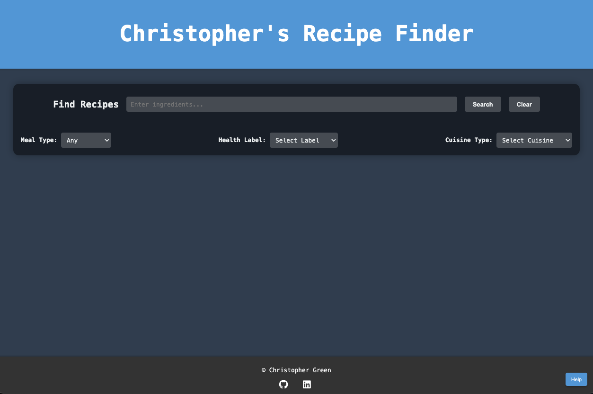

# Christopher's Recipe Finder



Explore a wide variety of delicious recipes with Christopher's Recipe Finder. Try it out here: [Christopher's Recipe Finder Live Site](https://cgreen66.github.io/RecipeFinder/)

## Overview
"Christopher's Recipe Finder" is a sophisticated web application designed for culinary enthusiasts. It streamlines the recipe discovery process by integrating user-friendly interfaces with real-time data fetching.

### Key Features
- **Ingredient-Based Recipe Search**: Users can search for recipes based on specific ingredients.
- **Advanced Filtering Options**: Recipes can be filtered by meal type and health labels.
- **Interactive Recipe Cards**: Concise summary of each recipe, including images and source details.
- **Comprehensive Nutritional Information**: Detailed breakdown of macronutrients available in a modal.
- **Responsive Design**: Ensures a seamless user experience across various devices.

## Technologies
- **Frontend**: HTML5, CSS3, Vanilla JavaScript.
- **Animations**: GreenSock Animation Platform (GSAP) for UI animations.
- **API Integration**: Real-time recipe data fetched from Edamam API.

## User Interface Highlights
- **Interactive Search Bar**: Autocomplete functionality for enhanced user experience.
- **Recipe Cards**: Attractive visuals with direct links to cooking instructions.
- **Nutritional Information Modals**: User-friendly presentation of comprehensive nutritional data.

## Code Examples

### Dynamic Recipe Search Functionality
```javascript
function fetchRecipes(query, health, mealType, cuisineType) {
    const apiUrl = 'https://api.edamam.com/api/recipes/v2';
    const apiParams = new URLSearchParams({ q: query, app_id: apiId, app_key: apiKey, type: 'public', health, mealType, cuisineType });

    fetch(`${apiUrl}?${apiParams}`)
        .then(response => response.json())
        .then(data => displayRecipes(data.hits))
        .catch(error => console.error('Fetch error:', error));
}
```

### Modal for Ingredients Display
```javascript
function showModal(content) {
    const modal = document.createElement('div');
    modal.className = 'modal';
    modal.innerHTML = `
        <div class="modal-content">
            <span class="close">&times;</span>
            ${content}
        </div>
    `;
    document.body.appendChild(modal);
    gsap.fromTo('.modal-content', { scale: 0.8, autoAlpha: 0 }, { scale: 1, autoAlpha: 1, duration: 0.5 });
}
```

## Future Implementations

- **Recipe Customization**: Modify recipes based on ingredients or dietary restrictions.
- **User Accounts and Recipe Saving**: Save favorite recipes and create cookbooks.
- **Data Visualization**: D3.js or similar for presenting data.
- **Community Features**: Share and rate recipes.
- **Mobile App**: Development of a mobile application for enhanced accessibility.
- **Multi-Language Support**: Expanding reach by supporting multiple languages.

## Contact

For inquiries, contact [Christopher Green](<christophergreennyc@gmail.com>).
